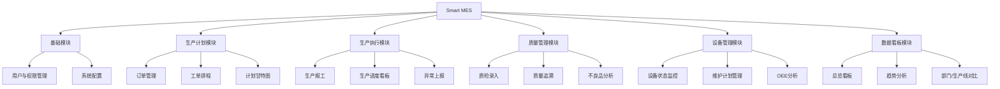
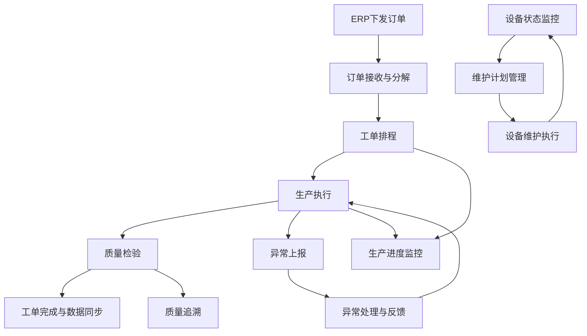

# 产品需求文档（PRD）

## 1. 文档信息

### 1.1 版本历史

| 版本 | 日期 | 作者 | 变更描述 |
|------|------|------|----------|
| V1.0 | 2025-11-25 | 产品团队 | 初始版本 |

### 1.2 文档目的

本文档详细描述了Smart MES（智能制造执行系统）的产品需求，包括产品概述、用户研究、市场分析、功能需求、交互设计、技术架构等内容，旨在为设计、开发、测试等团队提供明确的工作指导，确保产品按计划高质量交付。

### 1.3 相关文档引用

| 文档名称 | 版本 | 链接 |
|----------|------|------|
| Smart MES技术解决方案 | V1.0 | - |

## 2. 产品概述

### 2.1 产品名称与定位

- **产品名称**：Smart MES（智能制造执行系统）
- **产品定位**：面向制造企业的数字化生产管理平台，深度连接ERP系统与生产现场，实现生产全流程的透明化、智能化管理。

### 2.2 产品愿景与使命

- **愿景**：成为制造业数字化转型的核心支撑平台，助力企业实现高效、智能、可持续的生产管理。
- **使命**：通过技术创新，提升制造企业的生产效率与质量追溯能力，降低运营成本，增强市场竞争力。

### 2.3 价值主张与独特卖点（USP）

- **价值主张**：
  - 实现生产全流程的数字化管理，提升生产效率
  - 强化质量管控与追溯能力，降低质量风险
  - 实时监控设备状态，优化设备利用率
  - 提供数据驱动的决策支持，提升管理水平

- **独特卖点**：
  - 深度集成ERP系统，实现数据无缝流转
  - 可视化排程与生产进度监控，提升计划准确性
  - 全链路质量追溯，满足合规要求
  - 支持IoT设备接入，实时采集生产数据
  - 灵活的权限管理，适应企业组织架构

### 2.4 目标平台列表

- Web端（PC浏览器）

### 2.5 产品核心假设

1. 制造企业对生产流程数字化管理有强烈需求
2. 与ERP系统的集成是MES系统成功实施的关键
3. 可视化排程能够显著提升生产计划的准确性和执行效率
4. 实时数据采集与分析能够帮助企业及时发现并解决生产问题
5. 全链路质量追溯能够降低企业的质量风险和召回成本

### 2.6 商业模式概述

- **软件授权模式**：按企业规模和功能模块授权
- **SaaS模式**：按订阅周期收费
- **定制化开发**：根据企业特殊需求提供定制开发服务
- **实施与运维服务**：提供系统实施、培训和运维支持

## 3. 用户研究

### 3.1 目标用户画像

#### 3.1.1 人口统计特征

| 用户角色 | 年龄 | 教育程度 | 行业经验 |
|----------|------|----------|----------|
| 生产计划员 | 28-45岁 | 大专及以上 | 3-10年 |
| 车间主任 | 30-50岁 | 大专及以上 | 5-15年 |
| 质检员 | 25-40岁 | 中专及以上 | 2-8年 |
| 设备管理员 | 28-45岁 | 大专及以上 | 3-10年 |
| 生产操作员 | 20-40岁 | 中专及以上 | 1-5年 |
| 企业管理者 | 35-55岁 | 本科及以上 | 10-20年 |

#### 3.1.2 行为习惯与偏好

- 生产计划员：习惯使用Excel进行排程，关注计划的准确性和调整的灵活性
- 车间主任：关注实时生产进度和异常情况，需要快速响应和决策
- 质检员：注重数据的准确性和完整性，需要便捷的录入和查询方式
- 设备管理员：关注设备状态和维护计划，需要提前预警和故障分析
- 生产操作员：操作简单直观，减少手动录入，支持扫码操作
- 企业管理者：需要宏观的数据概览，支持决策分析

#### 3.1.3 核心需求与痛点

| 用户角色 | 核心需求 | 痛点 |
|----------|----------|------|
| 生产计划员 | 准确排程、快速调整 | 手工排程效率低、计划与实际脱节 |
| 车间主任 | 实时监控、异常处理 | 信息滞后、异常响应慢 |
| 质检员 | 便捷录入、准确追溯 | 纸质记录繁琐、追溯困难 |
| 设备管理员 | 状态监控、维护计划 | 设备故障突发、维护不及时 |
| 生产操作员 | 便捷报工、异常上报 | 手动录入繁琐、异常处理流程长 |
| 企业管理者 | 数据概览、决策支持 | 数据分散、难以获取整体生产状况 |

#### 3.1.4 动机与目标

- 生产计划员：提高排程效率，确保计划准确执行
- 车间主任：提升生产效率，降低异常发生率
- 质检员：确保产品质量，降低质量风险
- 设备管理员：提高设备利用率，减少停机时间
- 生产操作员：简化操作流程，提高工作效率
- 企业管理者：提升企业整体运营效率，增强市场竞争力

### 3.2 用户场景分析

#### 3.2.1 核心使用场景详述

1. **生产计划排程场景**
   - **场景描述**：生产计划员接收ERP系统下发的生产订单，根据产能、设备状况和物料可用性，进行工单排程
   - **用户行为**：登录系统 → 查看订单列表 → 进行工单排程 → 确认排程结果 → 发布生产计划
   - **系统响应**：提供拖拽式排程界面 → 实时计算产能负荷 → 生成甘特图展示 → 同步工单信息至车间

2. **生产执行与报工场景**
   - **场景描述**：生产操作员根据工单要求进行生产，完成后进行报工
   - **用户行为**：登录系统 → 扫描工单二维码 → 记录生产数量、不良品数量 → 提交报工信息
   - **系统响应**：验证工单信息 → 保存报工数据 → 更新工单进度 → 同步至生产进度看板

3. **质量检验场景**
   - **场景描述**：质检员在来料、过程和成品环节进行质量检验，记录检验结果
   - **用户行为**：登录系统 → 选择检验类型 → 录入检验数据 → 提交检验报告
   - **系统响应**：提供检验表单 → 保存检验数据 → 生成质量报告 → 支持质量追溯

4. **设备管理场景**
   - **场景描述**：设备管理员监控设备状态，制定维护计划，处理设备异常
   - **用户行为**：登录系统 → 查看设备状态看板 → 制定维护计划 → 处理设备异常
   - **系统响应**：实时展示设备状态 → 生成维护提醒 → 记录异常信息 → 计算OEE值

#### 3.2.2 边缘使用场景考量

1. **数据追溯场景**：客户投诉产品质量问题时，通过产品序列号查询生产全流程数据
2. **报表生成场景**：月末生成生产报表、质量报表、设备利用率报表等
3. **系统配置场景**：系统管理员进行工厂信息、生产线参数、工艺参数等基础数据配置

### 3.3 用户调研洞察（如适用）

- 制造企业普遍存在生产数据分散、信息不透明的问题
- 大部分企业仍使用手工或半自动化方式进行生产管理
- 对ERP系统集成需求强烈，希望实现数据无缝流转
- 可视化管理和实时监控是企业关注的重点
- 质量追溯能力是合规要求和客户需求的重要组成部分

## 4. 市场与竞品分析

### 4.1 市场规模与增长预测

- **市场规模**：根据行业报告，全球MES市场规模预计到2025年将达到XX亿美元，年复合增长率约为XX%
- **增长驱动因素**：
  - 制造业数字化转型加速
  - 工业4.0理念普及
  - 质量合规要求提高
  - 劳动力成本上升，企业寻求自动化解决方案

### 4.2 行业趋势分析

1. **智能化**：引入AI算法，实现智能排程、设备故障预测等功能
2. **物联网化**：深度集成IoT平台，实时采集设备数据
3. **云化**：SaaS模式的MES系统逐渐普及，降低企业实施成本
4. **模块化**：采用微服务架构，支持功能模块的灵活组合
5. **可视化**：提供更丰富的数据可视化展示，支持决策分析

### 4.3 竞争格局分析

#### 4.3.1 直接竞争对手详析

| 竞品名称 | 优势 | 劣势 | 定价 | 特性 |
|----------|------|------|------|------|
| 竞品A | 功能全面、成熟稳定 | 实施成本高、定制化能力弱 | 高 | 全流程管理、ERP集成、质量追溯 |
| 竞品B | 云化部署、易用性强 | 功能深度不足、行业适应性弱 | 中 | 基础生产管理、可视化看板、移动应用 |
| 竞品C | 行业经验丰富、定制化能力强 | 系统复杂度高、学习成本大 | 高 | 行业专用功能、深度集成、数据分析 |

#### 4.3.2 间接竞争对手概述

- **ERP系统供应商**：部分ERP系统包含MES功能模块，但深度和专业性不足
- **自动化设备供应商**：提供设备监控和数据采集系统，但缺乏整体生产管理能力
- **工业软件集成商**：提供定制化的生产管理解决方案，缺乏标准化产品

### 4.4 竞品功能对比矩阵

| 功能模块 | Smart MES | 竞品A | 竞品B | 竞品C |
|----------|-----------|-------|-------|-------|
| 生产计划排程 | ✓ | ✓ | ✓ | ✓ |
| 生产执行管理 | ✓ | ✓ | ✓ | ✓ |
| 质量管理 | ✓ | ✓ | ✓ | ✓ |
| 设备管理 | ✓ | ✓ | ✗ | ✓ |
| 数据追溯 | ✓ | ✓ | ✗ | ✓ |
| 可视化看板 | ✓ | ✓ | ✓ | ✓ |
| ERP集成 | ✓ | ✓ | ✗ | ✓ |
| IoT设备接入 | ✓ | ✗ | ✗ | ✓ |
| 移动应用 | 规划中 | ✓ | ✓ | ✗ |

### 4.5 市场差异化策略

1. **深度ERP集成**：提供与主流ERP系统的无缝集成，实现数据双向流转
2. **可视化排程**：提供直观的拖拽式排程界面，提升计划效率
3. **全链路质量追溯**：支持从原材料到成品的全流程质量追溯
4. **IoT设备接入**：实时采集设备数据，监控设备状态
5. **灵活的部署方式**：支持本地部署和云化部署，适应不同企业需求
6. **模块化设计**：支持功能模块的灵活组合，降低实施成本

## 5. 产品功能需求

### 5.1 功能架构与模块划分

### 5.2 核心功能详述

#### 5.2.1 基础模块

##### 5.2.1.1 用户与权限管理

- **功能描述**：作为系统管理员，我想要管理用户、角色和权限，以便确保不同用户只能访问其职责范围内的功能。
- **用户价值**：确保系统安全性，实现精细化的权限控制，适应企业组织架构。
- **功能逻辑与规则**：
  - 基于RBAC（角色基础访问控制）模型设计
  - 支持用户创建、修改、删除、查询
  - 支持角色创建、修改、删除、查询，以及角色与权限的关联
  - 支持权限管理，包括功能权限和数据权限
  - 用户登录成功后返回JWT令牌，后续请求携带令牌进行认证授权
- **交互要求**：
  - 提供用户登录/注销界面
  - 支持角色切换
  - 基于后端返回的权限列表动态渲染菜单
- **数据需求**：
  - 用户表（sys_user）：存储用户基本信息、登录凭证等
  - 角色表（sys_role）：存储角色信息
  - 权限表（sys_permission）：存储权限信息
  - 用户角色关联表：存储用户与角色的关联关系
  - 角色权限关联表：存储角色与权限的关联关系
- **技术依赖**：
  - Spring Security + JWT：实现认证授权
  - Redis：缓存用户会话信息
- **验收标准**：
  - 系统管理员能够成功创建、修改、删除用户
  - 系统管理员能够成功创建、修改、删除角色，并为角色分配权限
  - 用户登录成功后只能访问其权限范围内的功能
  - 无权限访问时返回403错误，前端跳转至无权限提示页面

##### 5.2.1.2 系统配置

- **功能描述**：作为系统管理员，我想要配置工厂信息、生产线参数、工艺参数等基础数据，以便系统能够适应企业的实际生产环境。
- **用户价值**：确保系统基础数据的准确性和一致性，为生产管理提供可靠的数据支持。
- **功能逻辑与规则**：
  - 支持工厂信息的增删改查
  - 支持生产线参数的增删改查
  - 支持工艺参数的增删改查
  - 支持数据字典管理，统一维护枚举值
- **交互要求**：
  - 提供直观的配置页面
  - 支持表单验证
  - 支持批量导入导出
- **数据需求**：
  - 工厂信息表：存储工厂基本信息
  - 生产线表：存储生产线信息
  - 工艺参数表：存储工艺参数信息
  - 数据字典表：存储枚举值信息
- **技术依赖**：
  - 无特殊技术依赖
- **验收标准**：
  - 系统管理员能够成功配置工厂信息、生产线参数、工艺参数
  - 配置的数据能够在其他模块中正常使用
  - 数据字典能够统一维护枚举值

#### 5.2.2 生产计划模块

##### 5.2.2.1 订单管理

- **功能描述**：作为生产计划员，我想要查看从ERP系统同步过来的生产订单，以便进行工单排程。
- **用户价值**：及时获取生产订单信息，为排程提供依据。
- **功能逻辑与规则**：
  - 支持从ERP系统同步生产订单（REST API或消息队列）
  - 支持订单状态管理（待排程、已排程、生产中、已完成）
  - 支持订单筛选与搜索
- **交互要求**：
  - 提供订单列表页面，清晰标示订单状态
  - 支持订单详情查看
  - 支持订单筛选与搜索
- **数据需求**：
  - 生产订单表（production_order）：存储订单信息
- **技术依赖**：
  - REST API或消息队列：与ERP系统集成
- **验收标准**：
  - 能够成功从ERP系统同步生产订单
  - 订单状态能够正确更新
  - 能够成功筛选与搜索订单

##### 5.2.2.2 工单排程

- **功能描述**：作为生产计划员，我想要将生产订单分解为工单，并分配到特定生产线、设备和物料，以便实现可视化排程。
- **用户价值**：提高排程效率，确保计划的准确性和可行性。
- **功能逻辑与规则**：
  - 支持将订单分解为工单
  - 提供拖拽式排程界面，允许用户将工单关联到特定生产线、设备和物料
  - 支持排程算法，简单场景下采用基于优先级的排序策略，复杂场景下预留接口集成高级APS系统
  - 支持排程结果的保存和修改
- **交互要求**：
  - 提供直观的拖拽式排程界面
  - 支持甘特图展示排程结果
  - 支持排程冲突提示
- **数据需求**：
  - 工单表（work_order）：存储工单信息
  - 排程表（scheduling）：存储排程结果
- **技术依赖**：
  - 甘特图组件：展示排程结果
- **验收标准**：
  - 能够成功将订单分解为工单
  - 能够通过拖拽方式进行工单排程
  - 排程结果能够正确保存和修改
  - 甘特图能够直观展示排程结果

##### 5.2.2.3 计划甘特图

- **功能描述**：作为生产计划员，我想要查看所有工单的时间线、资源分配情况及生产顺序，以便全面掌握生产计划。
- **用户价值**：直观了解生产计划，便于调整和优化。
- **功能逻辑与规则**：
  - 以甘特图形式可视化展示所有工单的排程情况
  - 支持按生产线、设备、时间等维度查看
  - 支持甘特图的缩放、平移等操作
- **交互要求**：
  - 提供甘特图展示界面
  - 支持多维度筛选
  - 支持甘特图操作
- **数据需求**：
  - 工单表（work_order）：存储工单信息
  - 排程表（scheduling）：存储排程结果
- **技术依赖**：
  - 甘特图组件：展示排程结果
- **验收标准**：
  - 甘特图能够正确展示所有工单的排程情况
  - 支持按生产线、设备、时间等维度查看
  - 甘特图操作流畅

#### 5.2.3 生产执行模块

##### 5.2.3.1 生产报工

- **功能描述**：作为生产操作员，我想要通过扫码或手动输入工单编号，快速记录生产产量、不良品数量、生产用时及完工时间，以便更新工单进度。
- **用户价值**：简化报工流程，提高工作效率，确保生产数据的准确性。
- **功能逻辑与规则**：
  - 支持扫码或手动输入工单编号
  - 支持记录生产产量、不良品数量、生产用时及完工时间
  - 支持报工数据的验证和保存
  - 报工后自动更新工单进度
- **交互要求**：
  - 提供简洁的报工界面
  - 支持扫码功能
  - 支持表单验证
- **数据需求**：
  - 报工记录表（production_record）：存储报工数据
- **技术依赖**：
  - 扫码组件：支持二维码扫描
- **验收标准**：
  - 能够通过扫码或手动输入工单编号进行报工
  - 报工数据能够正确保存
  - 工单进度能够自动更新

##### 5.2.3.2 生产进度看板

- **功能描述**：作为车间主任，我想要实时查看各工单的完成率、生产线当前状态、实时产量等关键信息，以便掌握生产进度。
- **用户价值**：实时了解生产状况，及时发现问题并调整。
- **功能逻辑与规则**：
  - 实时展示各工单的完成率
  - 展示生产线当前状态（运行、停机、换型等）
  - 展示实时产量等关键信息
  - 支持按生产线、工单等维度查看
- **交互要求**：
  - 提供直观的看板界面
  - 支持实时数据更新
  - 支持多维度筛选
- **数据需求**：
  - 工单表（work_order）：存储工单信息
  - 报工记录表（production_record）：存储报工数据
  - 生产线状态表：存储生产线状态信息
- **技术依赖**：
  - WebSocket：实现实时数据更新
- **验收标准**：
  - 看板能够实时展示工单完成率、生产线状态、实时产量等信息
  - 数据更新及时准确
  - 支持多维度筛选

##### 5.2.3.3 异常上报

- **功能描述**：作为生产操作员，我想要便捷地提交设备故障、物料短缺、工艺异常等问题，并附带图片或视频，以便及时处理异常。
- **用户价值**：快速上报异常，确保异常得到及时处理，减少生产损失。
- **功能逻辑与规则**：
  - 支持手动提交异常信息
  - 支持附带图片或视频
  - 支持异常类型分类
  - 异常信息通过消息队列推送给相关负责人
- **交互要求**：
  - 提供简洁的异常上报界面
  - 支持图片或视频上传
  - 支持异常类型选择
- **数据需求**：
  - 异常记录表（exception_record）：存储异常信息
- **技术依赖**：
  - RabbitMQ：推送异常通知
- **验收标准**：
  - 能够成功提交异常信息
  - 能够上传图片或视频
  - 相关负责人能够及时收到异常通知

#### 5.2.4 质量管理模块

##### 5.2.4.1 质检录入

- **功能描述**：作为质检员，我想要分别针对IQC（来料检验）、IPQC（过程检验）、FQC（成品检验）录入检验数据，以便记录检验结果。
- **用户价值**：规范检验流程，确保检验数据的准确性和完整性。
- **功能逻辑与规则**：
  - 分别针对IQC、IPQC、FQC设计专门的录入表单
  - 支持记录抽检数量、不良品数量、具体不良项目及检验员等信息
  - 支持检验结果的保存和查询
- **交互要求**：
  - 提供专门的质检录入界面
  - 支持表单验证
  - 支持批量录入
- **数据需求**：
  - 质检表（quality_inspection）：存储质检数据
  - 不良品表（defective_product）：存储不良品信息
- **技术依赖**：
  - 无特殊技术依赖
- **验收标准**：
  - 能够成功录入IQC、IPQC、FQC检验数据
  - 检验数据能够正确保存
  - 支持检验结果查询

##### 5.2.4.2 质量追溯

- **功能描述**：作为质量管理人员，我想要通过产品序列号查询该产品对应的生产批次、所用物料批次、操作员工、各工序质检结果、设备信息等全链路数据，以便进行质量追溯。
- **用户价值**：快速定位质量问题根源，降低质量风险和召回成本。
- **功能逻辑与规则**：
  - 支持通过产品序列号查询生产全流程数据
  - 支持多表联合查询，展示全链路数据
  - 支持追溯结果导出
- **交互要求**：
  - 提供产品序列号查询入口
  - 展示全链路追溯数据
  - 支持追溯结果导出
- **数据需求**：
  - 产品序列号表：存储产品序列号与生产数据的关联关系
  - 质检表（quality_inspection）：存储质检数据
  - 报工记录表（production_record）：存储生产数据
  - 物料批次表（material_batch）：存储物料批次信息
- **技术依赖**：
  - 无特殊技术依赖
- **验收标准**：
  - 能够通过产品序列号查询到全链路数据
  - 追溯数据准确完整
  - 能够成功导出追溯结果

##### 5.2.4.3 不良品分析图表

- **功能描述**：作为质量管理人员，我想要通过饼图展示不良类型占比，折线图展示不良率趋势，以便发现质量问题焦点。
- **用户价值**：直观了解质量状况，发现质量问题规律，采取改进措施。
- **功能逻辑与规则**：
  - 支持按时间维度、产品类型、生产线等维度分析不良品数据
  - 支持饼图展示不良类型占比
  - 支持折线图展示不良率趋势
- **交互要求**：
  - 提供直观的图表展示界面
  - 支持多维度筛选
  - 支持图表导出
- **数据需求**：
  - 不良品表（defective_product）：存储不良品信息
  - 质检表（quality_inspection）：存储质检数据
- **技术依赖**：
  - ECharts：图表展示
- **验收标准**：
  - 能够成功生成不良品分析图表
  - 图表数据准确
  - 支持多维度筛选和图表导出

#### 5.2.5 设备管理模块

##### 5.2.5.1 设备状态监控

- **功能描述**：作为设备管理员，我想要实时查看设备的运行状态、OEE值、累计运行时间等关键指标，以便监控设备状况。
- **用户价值**：实时掌握设备状态，及时发现设备异常，提高设备利用率。
- **功能逻辑与规则**：
  - 支持通过API对接PLC或IoT网关采集设备实时数据
  - 支持设备状态展示（运行、空闲、故障、维护）
  - 支持OEE值实时计算
  - 支持设备历史数据查询
- **交互要求**：
  - 提供设备状态看板
  - 支持实时数据更新
  - 支持设备详情查看
- **数据需求**：
  - 设备表（equipment）：存储设备基本信息
  - 设备状态表（equipment_status）：存储设备实时状态数据
- **技术依赖**：
  - WebSocket：实现实时数据更新
- **验收标准**：
  - 能够实时展示设备状态、OEE值、累计运行时间等信息
  - 数据更新及时准确
  - 能够查询设备历史数据

##### 5.2.5.2 维护计划管理

- **功能描述**：作为设备管理员，我想要创建、编辑设备预防性维护任务，并关联具体设备与维护周期，以便及时进行设备维护。
- **用户价值**：制定合理的维护计划，减少设备故障，延长设备使用寿命。
- **功能逻辑与规则**：
  - 支持创建、编辑、删除维护计划
  - 支持关联设备和维护周期
  - 支持维护计划执行记录
  - 支持维护提醒
- **交互要求**：
  - 提供维护计划管理界面
  - 支持维护计划创建和编辑
  - 支持维护执行记录录入
- **数据需求**：
  - 维护计划表（maintenance_plan）：存储维护计划信息
  - 维护执行记录表：存储维护执行记录
- **技术依赖**：
  - 无特殊技术依赖
- **验收标准**：
  - 能够成功创建、编辑、删除维护计划
  - 能够关联设备和维护周期
  - 能够记录维护执行情况
  - 能够发送维护提醒

##### 5.2.5.3 OEE分析

- **功能描述**：作为设备管理员，我想要查看设备的综合效率（OEE），以便分析设备利用率。
- **用户价值**：了解设备效率，发现设备改进空间，提高设备利用率。
- **功能逻辑与规则**：
  - 自动计算设备OEE值（设备有效运行时间 / 计划运行时间）
  - 支持按时间维度、设备类型等维度分析OEE数据
  - 支持OEE趋势图展示
- **交互要求**：
  - 提供OEE分析界面
  - 支持多维度筛选
  - 支持OEE趋势图展示
- **数据需求**：
  - 设备状态表（equipment_status）：存储设备运行数据
- **技术依赖**：
  - ECharts：图表展示
- **验收标准**：
  - 能够正确计算OEE值
  - 能够按多维度分析OEE数据
  - 能够展示OEE趋势图

#### 5.2.6 数据看板模块

##### 5.2.6.1 总览看板

- **功能描述**：作为企业管理者，我想要汇总查看当日/当月产量达成率、产品合格率、设备平均OEE、异常事件数量等核心生产指标，以便了解生产整体状况。
- **用户价值**：快速获取生产核心指标，把握生产整体状况。
- **功能逻辑与规则**：
  - 汇总展示核心生产指标
  - 支持按日/月维度查看
  - 数据缓存至Redis，提高查询性能
- **交互要求**：
  - 提供直观的总览看板界面
  - 支持数据维度切换
- **数据需求**：
  - 生产数据、质量数据、设备数据的汇总
- **技术依赖**：
  - Redis：缓存数据
  - ECharts：图表展示
- **验收标准**：
  - 能够正确展示核心生产指标
  - 数据更新及时准确
  - 支持按日/月维度查看

##### 5.2.6.2 趋势分析图表

- **功能描述**：作为企业管理者，我想要通过折线图展示产量、不良率等指标的历史变化趋势，通过柱状图对比不同时间段的生产数据，以便分析生产趋势。
- **用户价值**：了解生产历史趋势，发现生产规律，支持决策分析。
- **功能逻辑与规则**：
  - 支持折线图展示产量、不良率等指标的历史变化趋势
  - 支持柱状图对比不同时间段的生产数据
  - 支持多维度筛选
- **交互要求**：
  - 提供趋势分析图表界面
  - 支持多维度筛选
  - 支持图表导出
- **数据需求**：
  - 生产数据、质量数据的历史记录
- **技术依赖**：
  - ECharts：图表展示
- **验收标准**：
  - 能够成功生成趋势分析图表
  - 图表数据准确
  - 支持多维度筛选和图表导出

##### 5.2.6.3 部门/生产线对比

- **功能描述**：作为企业管理者，我想要使用雷达图或柱状图对比不同生产线或生产部门的产能、效率、合格率等多维度指标，以便识别优势与短板。
- **用户价值**：对比不同部门/生产线的绩效，发现改进空间，优化资源配置。
- **功能逻辑与规则**：
  - 支持雷达图或柱状图对比不同部门/生产线的指标
  - 支持多指标对比
  - 支持自定义对比维度
- **交互要求**：
  - 提供部门/生产线对比界面
  - 支持图表类型切换
  - 支持多指标选择
- **数据需求**：
  - 各部门/生产线的生产数据、质量数据、设备数据
- **技术依赖**：
  - ECharts：图表展示
- **验收标准**：
  - 能够成功生成部门/生产线对比图表
  - 图表数据准确
  - 支持图表类型切换和多指标选择

### 5.3 次要功能描述

1. **报表生成**：支持生成生产报表、质量报表、设备报表等
2. **数据导入导出**：支持批量导入导出基础数据、生产数据等
3. **系统日志**：记录系统操作日志，便于审计和故障排查
4. **消息通知**：支持系统消息、任务提醒等

### 5.4 未来功能储备（Backlog）

1. **移动应用**：开发微信小程序或原生APP，支持移动端操作
2. **AI智能算法**：
   - 设备故障预测
   - 智能生产排程
3. **深度对接IoT平台**：引入MQTT协议，实现与IoT平台的无缝对接
4. **高级数据分析**：提供更丰富的数据分析功能，支持自定义报表
5. **电子签名**：支持关键操作的电子签名，满足合规要求

## 6. 用户流程与交互设计指导

### 6.1 核心用户旅程地图

### 6.2 关键流程详述与状态转换图

#### 6.2.1 订单到生产全流程

1. **ERP下发订单**：ERP系统将生产订单数据通过REST API或消息队列同步至Smart MES
2. **订单接收与分解**：MES接收订单，计划员将其分解为具体的生产工单
3. **工单排程**：计划员通过拖拽式排程界面，将工单分配到特定生产线、设备和物料
4. **生产执行**：操作员扫描工单二维码开工，实时上报产量、不良品数量
5. **质量检验**：质检员在来料、过程、成品环节录入质检数据
6. **工单完成与数据同步**：工单生产完成后，系统自动更新工单状态，并将生产数据同步至数据看板

#### 6.2.2 设备异常处理流程

1. **异常发生与上报**：设备出现故障停机，可由传感器自动检测并上报，或由操作员手动提交异常信息
2. **异常记录与通知**：MES后端保存异常记录，并通过RabbitMQ消息队列将异常通知推送给相关维修人员和管理人员
3. **异常处理与反馈**：维修人员接收到通知后进行故障排查与维修，处理完成后在系统中更新异常状态及处理结果
4. **数据统计与分析**：系统自动计算设备此次停机时间，并将其纳入OEE计算

### 6.3 对设计师（UI/UX Agent）的界面原型参考说明和要求

1. **整体风格**：简洁、专业、易用，符合制造业用户习惯
2. **色彩方案**：主色调采用蓝色系（代表专业、信任），辅以绿色（代表正常、成功）和红色（代表异常、警告）
3. **布局设计**：采用侧边栏菜单+主内容区的经典布局，支持响应式设计
4. **关键界面要求**：
   - 排程界面：提供直观的拖拽式操作，甘特图清晰展示工单时间线
   - 看板界面：数据可视化直观，重点信息突出显示
   - 报工界面：简洁易用，支持扫码操作
   - 异常上报界面：操作便捷，支持图片/视频上传
5. **交互设计**：
   - 操作反馈及时，提供加载状态提示
   - 支持批量操作，提高工作效率
   - 表单验证严格，确保数据准确性

### 6.4 交互设计规范与原则建议

1. **一致性原则**：保持界面元素、操作方式的一致性
2. **简洁性原则**：减少不必要的界面元素和操作步骤
3. **反馈原则**：及时向用户反馈操作结果
4. **容错原则**：提供错误提示和恢复机制
5. **易用性原则**：符合用户习惯，减少学习成本
6. **可访问性原则**：支持键盘导航，确保不同用户群体都能正常使用

## 7. 非功能需求

### 7.1 性能需求

1. **响应时间**：
   - 页面加载时间：< 2秒
   - 数据查询时间：< 1秒（非复杂查询）
   - 实时数据更新延迟：< 5秒

2. **并发量**：
   - 支持同时在线用户数：> 500
   - 支持并发请求数：> 1000 QPS

3. **稳定性**：
   - 系统可用性：> 99.5%
   - 支持7×24小时连续运行

4. **资源使用率**：
   - CPU使用率：峰值 < 80%
   - 内存使用率：峰值 < 80%
   - 磁盘使用率：< 70%

### 7.2 安全需求

1. **数据加密**：
   - 传输层加密：采用HTTPS协议
   - 存储加密：敏感数据加密存储

2. **认证授权**：
   - 基于JWT的身份认证
   - 基于RBAC的权限控制
   - 支持多因素认证（可选）

3. **隐私保护**：
   - 严格遵守数据隐私法规
   - 支持数据脱敏处理

4. **防攻击策略**：
   - 防止SQL注入、XSS攻击
   - 防止CSRF攻击
   - 实现接口限流、熔断机制

### 7.3 可用性与可访问性标准

1. **易用性要求**：
   - 系统学习曲线平缓，新用户培训时间 < 8小时
   - 操作流程简洁，关键任务完成步骤 < 5步

2. **可访问性标准**：
   - 符合WCAG 2.1 AA级标准
   - 支持键盘导航
   - 支持屏幕阅读器

### 7.4 合规性要求

1. **行业法规**：
   - 符合ISO 9001质量管理体系要求
   - 符合行业特定的质量追溯要求

2. **数据法规**：
   - 符合GDPR、CCPA等数据隐私法规
   - 支持数据审计和日志记录

### 7.5 数据统计与分析需求

1. **埋点跟踪**：
   - 用户登录、退出行为
   - 关键功能模块的使用频率
   - 页面停留时间
   - 操作错误率

2. **分析指标**：
   - 系统使用率
   - 功能模块使用率
   - 用户活跃度
   - 操作效率

## 8. 技术架构考量

### 8.1 技术栈建议

#### 8.1.1 前端技术栈（Vue生态）

- 核心框架：Vue 3 + Vite
- 状态管理：Pinia
- 路由管理：Vue Router 4
- UI组件库：Element Plus
- 图表可视化：ECharts
- 网络请求：Axios
- 辅助工具：Vue-i18n（多语言支持）、Vuelidate（表单验证）

#### 8.1.2 后端技术栈（Spring生态）

- 核心框架：Spring Boot 3.x
- 安全框架：Spring Security + JWT
- 数据访问：Spring Data JPA + MyBatis
- 数据库：MySQL 8.0（主数据存储） + Redis（缓存热点数据、管理用户会话）
- 消息队列：RabbitMQ（处理生产事件通知、异步任务）
- API文档：SpringDoc + Swagger UI
- 辅助工具：EasyExcel（高效处理Excel导入导出）、Logback（日志管理与分析）

### 8.2 系统集成需求

1. **ERP系统集成**：
   - 支持REST API或消息队列方式集成
   - 实现生产订单、物料信息等数据的双向流转

2. **IoT设备集成**：
   - 支持通过API对接PLC或IoT网关
   - 支持MQTT协议（未来扩展）

3. **第三方系统集成**：
   - 支持与质量检测设备、条码扫描设备等集成

### 8.3 技术依赖与约束

1. **浏览器支持**：
   - Chrome（推荐）
   - Firefox
   - Safari
   - Edge

2. **数据库版本**：
   - MySQL 8.0+
   - Redis 6.0+

3. **服务器环境**：
   - JDK 17+
   - Node.js 16+

### 8.4 数据模型建议（关键实体的属性和关系）

1. **用户（User）**：
   - 属性：id、用户名、密码、姓名、邮箱、电话、角色ID
   - 关系：多对一（角色）

2. **角色（Role）**：
   - 属性：id、角色名称、描述
   - 关系：多对多（权限）

3. **权限（Permission）**：
   - 属性：id、权限名称、权限标识、资源类型、资源路径
   - 关系：多对多（角色）

4. **生产订单（ProductionOrder）**：
   - 属性：id、订单编号、产品名称、数量、交货日期、状态
   - 关系：一对多（工单）

5. **工单（WorkOrder）**：
   - 属性：id、工单编号、订单ID、产品名称、数量、生产线ID、设备ID、状态
   - 关系：多对一（生产订单）、多对一（生产线）、多对一（设备）

6. **质检记录（QualityInspection）**：
   - 属性：id、检验类型、工单ID、抽检数量、不良品数量、检验员、检验日期
   - 关系：多对一（工单）

7. **设备（Equipment）**：
   - 属性：id、设备编号、设备名称、设备类型、状态、OEE值
   - 关系：一对多（设备状态）、一对多（维护计划）

## 9. 验收标准汇总

### 9.1 功能验收标准矩阵

| 功能模块 | 验收标准 |
|----------|----------|
| 用户与权限管理 | 能够成功创建、修改、删除用户和角色；权限控制生效，无权限用户无法访问受限功能 |
| 订单管理 | 能够成功从ERP系统同步生产订单；订单状态能够正确更新；能够成功筛选与搜索订单 |
| 工单排程 | 能够成功将订单分解为工单；能够通过拖拽方式进行工单排程；甘特图能够直观展示排程结果 |
| 生产报工 | 能够通过扫码或手动输入工单编号进行报工；报工数据能够正确保存；工单进度能够自动更新 |
| 生产进度看板 | 能够实时展示工单完成率、生产线状态、实时产量等信息；数据更新及时准确 |
| 异常上报 | 能够成功提交异常信息；能够上传图片或视频；相关负责人能够及时收到异常通知 |
| 质检录入 | 能够成功录入IQC、IPQC、FQC检验数据；检验数据能够正确保存 |
| 质量追溯 | 能够通过产品序列号查询到全链路数据；追溯数据准确完整 |
| 设备状态监控 | 能够实时展示设备状态、OEE值、累计运行时间等信息；数据更新及时准确 |
| 维护计划管理 | 能够成功创建、编辑、删除维护计划；能够关联设备和维护周期；能够记录维护执行情况 |
| 数据看板 | 能够正确展示核心生产指标；数据更新及时准确；支持多维度筛选和图表展示 |

### 9.2 性能验收标准

| 性能指标 | 验收标准 |
|----------|----------|
| 页面加载时间 | < 2秒 |
| 数据查询时间 | < 1秒（非复杂查询） |
| 实时数据更新延迟 | < 5秒 |
| 并发用户数 | > 500 |
| 系统可用性 | > 99.5% |

### 9.3 质量验收标准

1. **Bug密度**：< 0.5个/功能点
2. **代码覆盖率**：> 80%
3. **安全漏洞**：通过安全扫描，无高危漏洞
4. **用户体验**：通过用户测试，满意度 > 85%

## 10. 产品成功指标

### 10.1 关键绩效指标（KPIs）定义与目标

| KPI指标 | 目标值 | 计算方式 |
|---------|--------|----------|
| 生产效率提升 | > 10% | （实施后产能 - 实施前产能）/ 实施前产能 × 100% |
| 质量追溯时间缩短 | > 50% | （实施前追溯时间 - 实施后追溯时间）/ 实施前追溯时间 × 100% |
| 设备OEE提升 | > 5% | （实施后OEE - 实施前OEE）/ 实施前OEE × 100% |
| 异常处理时间缩短 | > 30% | （实施前处理时间 - 实施后处理时间）/ 实施前处理时间 × 100% |
| 系统使用率 | > 90% | 活跃用户数 / 总用户数 × 100% |

### 10.2 北极星指标定义与选择依据

- **北极星指标**：生产效率提升率
- **选择依据**：
  - 直接反映产品核心价值
  - 能够量化产品对企业的贡献
  - 与企业的核心目标一致
  - 能够驱动其他指标的提升

### 10.3 指标监测计划

1. **数据收集方式**：
   - 系统自动采集生产数据、设备数据、质量数据等
   - 用户操作日志记录
   - 定期用户调研

2. **报告频率**：
   - 日报：生产进度、产量、异常情况等
   - 周报：周生产总结、质量分析、设备利用率等
   - 月报：月生产报表、质量报表、设备报表等
   - 季报：季度KPI达成情况、产品改进建议等

3. **分析方法**：
   - 趋势分析：分析指标的历史变化趋势
   - 对比分析：对比不同时间段、不同生产线的指标
   - 归因分析：分析指标变化的原因
   - 预测分析：预测未来指标的变化趋势