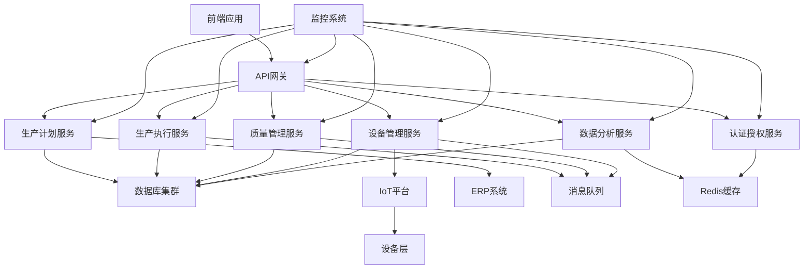
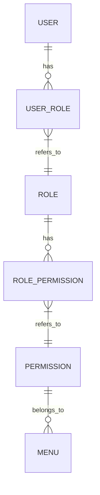
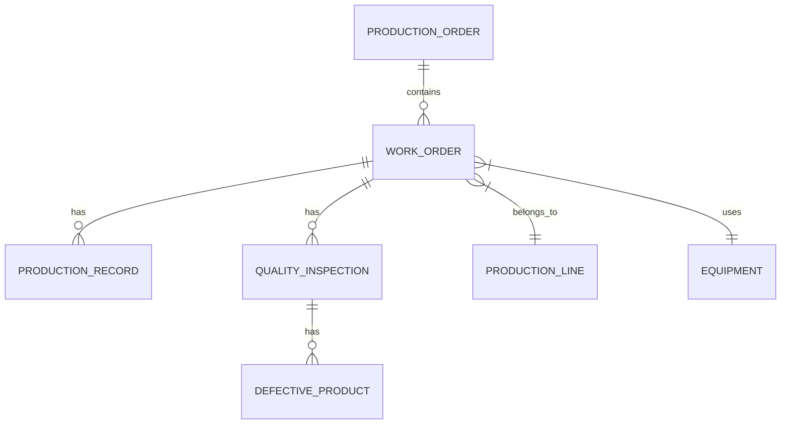
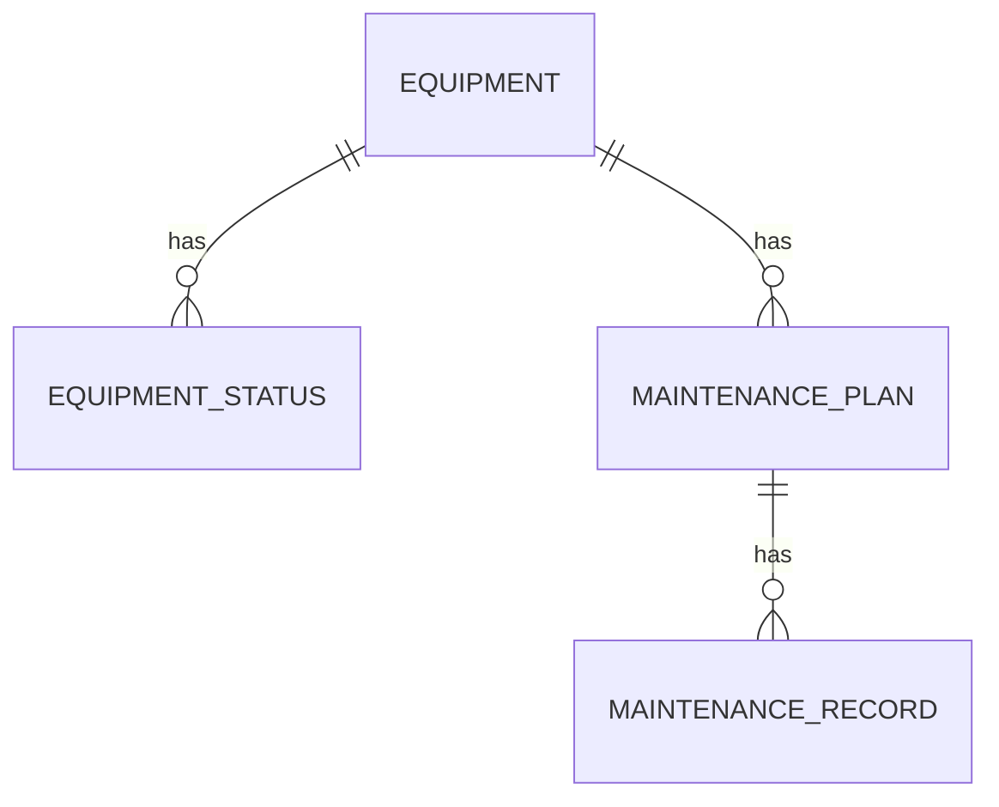
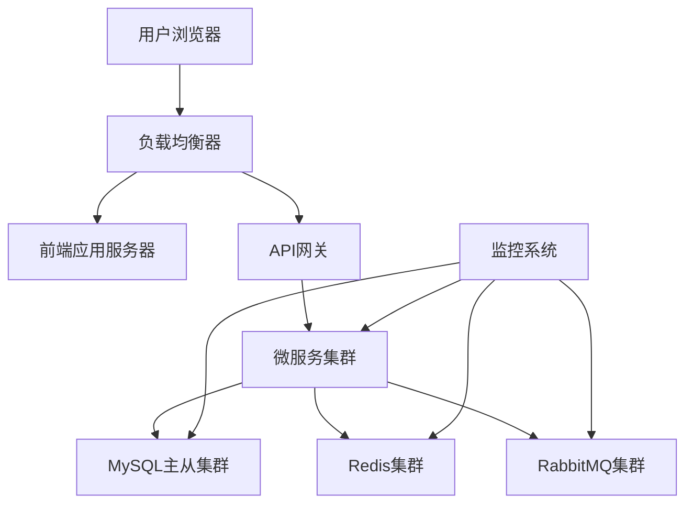

# Smart MES系统技术方案

## 1. 文档信息

### 1.1 版本历史

| 版本 | 日期 | 作者 | 变更描述 |
|------|------|------|----------|
| V1.0 | 2025-11-25 | 技术团队 | 初始版本 |

### 1.2 文档目的

本文档详细描述了Smart MES系统的技术方案，包括技术栈选择、架构设计、数据存储方案、系统集成方案等，旨在为开发团队提供明确的技术指导，确保系统按照设计要求高质量实现。

### 1.3 相关文档引用

| 文档名称 | 版本 | 链接 |
|----------|------|------|
| Smart MES产品需求文档 | V1.0 | docs/PRD.md |
| Smart MES产品路线图 | V1.0 | docs/Roadmap.md |
| Smart MES用户故事地图 | V1.0 | docs/User_Story_Map.md |

## 2. 技术栈选择

### 2.1 前端技术栈

| 技术/框架 | 版本 | 用途 | 选型理由 |
|----------|------|------|----------|
| Vue.js | 3.x | 前端框架 | 渐进式框架，生态成熟，学习成本低，性能优异 |
| Vite | 5.x | 构建工具 | 快速的冷启动，即时的热模块替换，优化的构建输出 |
| Element Plus | 2.x | UI组件库 | 基于Vue 3的企业级组件库，丰富的组件，良好的文档 |
| Pinia | 2.x | 状态管理 | Vue官方推荐，轻量，支持TypeScript |
| Vue Router | 4.x | 路由管理 | Vue官方路由，支持组合式API |
| Axios | 1.x | HTTP客户端 | 支持拦截器，Promise API，广泛使用 |
| ECharts | 5.x | 图表库 | 丰富的图表类型，良好的交互性，支持大数据量 |
| DHTMLX Gantt | 8.x | 甘特图组件 | 成熟的甘特图解决方案，支持拖拽式排程 |
| Vue Qrcode Reader | 5.x | 二维码扫描 | 基于Vue的二维码扫描组件，易于集成 |

### 2.2 后端技术栈

| 技术/框架 | 版本 | 用途 | 选型理由 |
|----------|------|------|----------|
| Spring Boot | 3.x | 后端框架 | 简化Spring应用开发，内嵌Tomcat，自动配置 |
| Spring Security | 6.x | 安全框架 | 强大的认证授权机制，支持JWT |
| Spring Data JPA | 3.x | ORM框架 | 简化数据库操作，支持自动生成SQL |
| MyBatis | 3.x | 持久层框架 | 灵活的SQL编写，支持复杂查询 |
| MySQL | 8.0 | 关系型数据库 | 成熟稳定，性能优异，支持事务 |
| Redis | 7.0 | 缓存数据库 | 高性能键值存储，支持多种数据结构 |
| RabbitMQ | 3.13 | 消息队列 | 可靠的消息传递，支持多种协议，易于扩展 |
| WebSocket | - | 实时通信 | 支持双向通信，用于实时数据推送 |
| SpringDoc OpenAPI | 2.x | API文档 | 基于OpenAPI 3.0，自动生成API文档 |
| EasyExcel | 3.x | Excel处理 | 高性能的Excel读写，支持大数据量 |
| Logback | 1.4 | 日志框架 | 灵活的日志配置，支持多种输出方式 |

### 2.3 开发工具与环境

| 工具/环境 | 版本 | 用途 |
|----------|------|------|
| JDK | 17 | Java开发环境 |
| Node.js | 18.x | 前端开发环境 |
| Maven | 3.9 | Java项目构建工具 |
| npm | 9.x | 前端包管理工具 |
| Git | 2.40 | 版本控制工具 |
| IDEA | 2024 | Java开发IDE |
| VS Code | 1.85 | 前端开发IDE |
| Docker | 24.x | 容器化部署 |
| Jenkins | 2.401 | CI/CD工具 |

## 3. 架构设计

### 3.1 系统架构图

### 3.2 架构特点

1. **微服务架构**：系统采用微服务架构，将不同业务领域划分为独立的服务，便于独立开发、部署和扩展
2. **前后端分离**：前端采用Vue 3开发单页应用，后端提供RESTful API，实现前后端解耦
3. **API网关**：统一的API入口，负责路由转发、请求限流、熔断降级等
4. **服务注册与发现**：支持服务的自动注册和发现，便于服务之间的通信
5. **分布式缓存**：使用Redis缓存热点数据，提高系统响应速度
6. **消息队列**：使用RabbitMQ处理异步任务和事件通知，提高系统可靠性
7. **实时通信**：使用WebSocket实现实时数据推送，如生产进度、设备状态等
8. **容器化部署**：支持Docker容器化部署，便于环境一致性和快速扩展

### 3.3 微服务划分

| 服务名称 | 主要功能 | 技术栈 |
|----------|----------|--------|
| 认证授权服务 | 用户认证、权限管理、令牌生成 | Spring Boot、Spring Security、JWT、Redis |
| 生产计划服务 | 订单管理、工单排程、计划甘特图 | Spring Boot、Spring Data JPA、MySQL |
| 生产执行服务 | 生产报工、生产进度监控、异常上报 | Spring Boot、WebSocket、MySQL |
| 质量管理服务 | 质检录入、质量追溯、不良品分析 | Spring Boot、MyBatis、MySQL |
| 设备管理服务 | 设备状态监控、维护计划管理、OEE分析 | Spring Boot、WebSocket、RabbitMQ、MySQL |
| 数据分析服务 | 总览看板、趋势分析、部门/生产线对比 | Spring Boot、ECharts、MySQL、Redis |

## 4. 数据存储方案

### 4.1 数据库设计

#### 4.1.1 数据库选型

| 数据类型 | 数据库 | 用途 |
|----------|--------|------|
| 结构化数据 | MySQL | 存储业务数据，如用户、订单、工单、质检记录等 |
| 缓存数据 | Redis | 存储热点数据、会话信息、临时数据等 |
| 消息数据 | RabbitMQ | 存储消息队列数据，用于异步处理 |

#### 4.1.2 数据库架构

1. **MySQL架构**：
   - 采用主从复制架构，提高读写性能和数据可靠性
   - 主库负责写操作，从库负责读操作
   - 支持自动故障切换

2. **Redis架构**：
   - 采用哨兵模式，提高Redis的可用性
   - 支持数据持久化（RDB+AOF）
   - 用于缓存热点数据、用户会话、分布式锁等

### 4.2 核心数据模型

#### 4.2.1 用户与权限模型

#### 4.2.2 生产管理模型

#### 4.2.3 设备管理模型

### 4.3 数据同步方案

1. **ERP系统集成**：
   - 采用REST API方式，定时从ERP系统同步生产订单
   - 支持增量同步，只同步新增或修改的订单
   - 同步失败时，支持重试机制和异常告警

2. **IoT设备数据集成**：
   - 支持通过WebSocket或MQTT协议实时采集设备数据
   - 设备数据先写入Redis缓存，再定时批量写入MySQL
   - 支持数据格式转换和校验

3. **跨服务数据同步**：
   - 采用事件驱动架构，通过RabbitMQ传递数据变更事件
   - 服务订阅相关事件，更新本地数据
   - 支持最终一致性

## 5. 系统集成方案

### 5.1 ERP系统集成

| 集成方式 | 技术实现 | 数据流向 |
|----------|----------|----------|
| REST API | Spring Boot + RestTemplate | ERP → MES：生产订单、物料信息 MES → ERP：生产进度、成品入库 |
| 消息队列 | RabbitMQ | ERP → MES：生产订单变更通知 |

### 5.2 IoT平台集成

| 集成方式 | 技术实现 | 数据流向 |
|----------|----------|----------|
| WebSocket | Spring Boot + WebSocket | IoT平台 → MES：设备实时数据 |
| MQTT | Eclipse Paho | IoT平台 → MES：设备实时数据（未来扩展） |
| REST API | Spring Boot + RestTemplate | MES → IoT平台：设备控制指令 |

### 5.3 第三方系统集成

| 系统类型 | 集成方式 | 用途 |
|----------|----------|------|
| 条码扫描设备 | USB接口 + SDK | 工单扫码开工、产品条码扫描 |
| 质量检测设备 | RS232/以太网 + 自定义协议 | 自动采集质量检测数据 |
| 电子看板 | HDMI接口 + Web页面 | 展示生产进度、设备状态等 |

## 6. 性能优化方案

### 6.1 前端性能优化

1. **代码分割**：
   - 使用Vue Router的懒加载，按需加载路由组件
   - 利用Vite的代码分割功能，减小初始加载体积

2. **缓存策略**：
   - 使用浏览器缓存，合理设置Cache-Control头
   - 使用本地存储（localStorage/sessionStorage）缓存静态数据

3. **渲染优化**：
   - 使用v-if和v-show合理控制组件渲染
   - 对于大数据列表，使用虚拟滚动
   - 避免不必要的DOM操作和重排重绘

4. **网络优化**：
   - 使用HTTP/2协议，支持多路复用
   - 启用Gzip压缩，减小传输体积
   - 使用CDN加速静态资源加载

### 6.2 后端性能优化

1. **数据库优化**：
   - 合理设计索引，提高查询性能
   - 优化SQL语句，避免全表扫描
   - 使用分页查询，减少数据传输量
   - 采用读写分离，提高并发能力

2. **缓存优化**：
   - 使用Redis缓存热点数据，如用户信息、配置数据等
   - 合理设置缓存过期时间，避免缓存雪崩
   - 使用缓存预热，提高系统响应速度

3. **并发优化**：
   - 使用线程池处理并发请求
   - 合理设置连接池大小，如数据库连接池、Redis连接池等
   - 避免长时间占用数据库连接

4. **异步处理**：
   - 使用RabbitMQ处理异步任务，如发送邮件、生成报表等
   - 使用CompletableFuture处理并行任务

### 6.3 系统监控与调优

1. **监控方案**：
   - 使用Spring Boot Actuator监控应用健康状态
   - 集成Prometheus + Grafana，实现系统指标监控
   - 使用ELK Stack（Elasticsearch + Logstash + Kibana）进行日志管理和分析

2. **性能测试**：
   - 使用JMeter进行负载测试，模拟高并发场景
   - 分析性能瓶颈，针对性进行优化
   - 定期进行性能测试，确保系统性能符合要求

## 7. 安全方案

### 7.1 认证与授权

1. **认证机制**：
   - 使用JWT（JSON Web Token）进行用户认证
   - 支持用户名密码登录、短信验证码登录等方式
   - 实现Token过期自动刷新机制

2. **授权机制**：
   - 基于RBAC（角色基础访问控制）模型
   - 细粒度的权限控制，支持功能权限和数据权限
   - 动态权限管理，支持实时更新用户权限

3. **安全防护**：
   - 防止SQL注入，使用参数化查询
   - 防止XSS攻击，对输入数据进行过滤和转义
   - 防止CSRF攻击，使用Token验证
   - 防止暴力破解，实现登录失败次数限制

### 7.2 数据安全

1. **数据加密**：
   - 传输层加密：使用HTTPS协议
   - 存储层加密：对敏感数据（如密码）进行加密存储
   - 数据脱敏：对敏感数据（如手机号、身份证号）进行脱敏处理

2. **数据备份与恢复**：
   - 定期备份数据库，支持全量备份和增量备份
   - 实现数据恢复机制，确保数据可恢复
   - 异地备份，提高数据安全性

3. **访问控制**：
   - 严格的访问控制策略，只允许授权IP访问
   - 实现API接口的访问频率限制
   - 记录详细的操作日志，便于审计和追溯

## 8. 部署方案

### 8.1 部署架构

### 8.2 部署方式

1. **容器化部署**：
   - 使用Docker容器化所有服务
   - 使用Docker Compose管理本地开发环境
   - 使用Kubernetes进行生产环境部署，支持自动扩缩容

2. **环境配置**：
   - 开发环境：本地Docker Compose
   - 测试环境：独立的测试服务器，与生产环境隔离
   - 生产环境：Kubernetes集群，高可用部署

3. **CI/CD流程**：
   - 使用GitLab/GitHub作为代码仓库
   - 使用Jenkins实现持续集成和持续部署
   - 自动化测试：单元测试、集成测试、UI测试
   - 自动化部署：代码提交后自动构建、测试、部署

## 9. 开发规范

### 9.1 编码规范

1. **Java编码规范**：
   - 遵循阿里巴巴Java开发手册
   - 使用Lombok简化代码
   - 强制使用TypeScript

2. **前端编码规范**：
   - 遵循Vue官方编码规范
   - 使用ESLint + Prettier进行代码检查和格式化
   - 强制使用TypeScript

3. **数据库编码规范**：
   - 表名和字段名使用下划线命名法
   - 所有表必须包含创建时间、更新时间字段
   - 合理设置字段类型和长度
   - 必须创建主键，推荐使用自增ID或UUID

### 9.2 文档规范

1. **API文档**：
   - 使用SpringDoc OpenAPI自动生成API文档
   - 每个API必须包含详细的描述、参数说明、返回值说明
   - API文档地址：http://localhost:8080/swagger-ui.html

2. **技术文档**：
   - 使用Markdown格式编写技术文档
   - 文档必须包含目录、版本历史、详细内容
   - 文档存放路径：docs/

3. **代码注释**：
   - 类、方法必须包含Javadoc/KDoc注释
   - 复杂逻辑必须添加注释说明
   - 注释必须清晰、准确，避免冗余

## 10. 项目管理

### 10.1 开发流程

1. **敏捷开发**：
   - 采用Scrum敏捷开发方法
   - 迭代周期：2周
   - 每次迭代包含计划会议、每日站会、评审会议、回顾会议

2. **需求管理**：
   - 使用Jira管理需求和任务
   - 需求状态：待开发、开发中、测试中、已完成、已上线
   - 每个需求必须包含详细的描述、验收标准、优先级等

3. **代码管理**：
   - 使用Git进行版本控制
   - 分支策略：
     - main：主分支，用于发布生产版本
     - develop：开发分支，用于集成各功能分支
     - feature/*：功能分支，用于开发新功能
     - hotfix/*：修复分支，用于修复生产环境bug
   - 提交规范：使用Conventional Commits规范

### 10.2 团队协作

1. **沟通工具**：
   - 使用企业微信进行日常沟通
   - 使用Jira进行任务管理和跟踪
   - 使用Confluence进行文档协作

2. **知识共享**：
   - 定期举行技术分享会
   - 建立知识库，记录技术方案、问题解决方案等
   - 代码评审，提高代码质量和团队技术水平

## 11. 风险评估与应对

### 11.1 技术风险

| 风险项 | 风险描述 | 应对措施 |
|--------|----------|----------|
| ERP系统集成复杂度高 | 不同ERP系统的接口差异较大，集成难度高 | 采用标准化接口设计，支持多种ERP系统的适配器开发，建立完善的测试机制 |
| IoT设备兼容性问题 | 设备类型多样，通信协议不一致 | 支持多种通信协议，提供设备接入SDK，建立设备接入测试环境 |
| 大数据处理性能问题 | 生产数据量大，查询性能可能受到影响 | 采用缓存技术（Redis），优化数据库查询，考虑分库分表，使用大数据处理技术 |
| 实时数据推送压力大 | 大量实时数据需要推送，可能导致系统性能下降 | 优化WebSocket实现，使用消息队列缓冲，采用分布式部署 |

### 11.2 项目风险

| 风险项 | 风险描述 | 应对措施 |
|--------|----------|----------|
| 需求变更频繁 | 客户需求可能频繁变更，影响项目进度 | 采用敏捷开发方法，定期与客户沟通，控制需求变更范围，建立变更管理流程 |
| 人员变动风险 | 核心团队成员可能离职，影响项目进展 | 建立完善的知识管理体系，文档化开发过程，培养后备人员，加强团队凝聚力 |
| 测试不充分 | 功能测试不充分，上线后可能出现大量问题 | 采用自动化测试，增加测试用例覆盖率，进行充分的用户测试，建立灰度发布机制 |
| 上线风险 | 系统上线后可能出现性能问题或故障 | 制定详细的上线计划，进行充分的预发布测试，建立回滚机制，加强上线后的监控 |

## 12. 结论与建议

### 12.1 结论

本技术方案详细描述了Smart MES系统的技术栈选择、架构设计、数据存储方案、系统集成方案等，为开发团队提供了明确的技术指导。方案采用了微服务架构、前后端分离、容器化部署等现代技术，具有良好的扩展性、可靠性和性能。

### 12.2 建议

1. **优先实现核心功能**：按照产品路线图，优先实现MVP版本的核心功能，快速验证产品价值
2. **注重系统集成**：加强与ERP系统、IoT平台的集成测试，确保数据流转顺畅
3. **重视性能优化**：从设计阶段就考虑性能问题，定期进行性能测试和优化
4. **加强安全防护**：建立完善的安全机制，保护系统和数据安全
5. **持续迭代改进**：根据用户反馈和技术发展，持续迭代改进系统功能和性能

## 13. 附录

### 13.1 术语表

| 术语 | 解释 |
|------|------|
| MES | Manufacturing Execution System，制造执行系统 |
| ERP | Enterprise Resource Planning，企业资源计划 |
| IoT | Internet of Things，物联网 |
| JWT | JSON Web Token，基于JSON的开放标准，用于在各方之间安全地传输信息 |
| API | Application Programming Interface，应用程序编程接口 |
| REST | Representational State Transfer，表现层状态转移，一种软件架构风格 |
| WebSocket | 一种网络通信协议，支持双向通信 |
| CI/CD | Continuous Integration/Continuous Deployment，持续集成/持续部署 |
| KPI | Key Performance Indicator，关键绩效指标 |
| OEE | Overall Equipment Effectiveness，设备综合效率 |