# 用户故事地图（User Story Map）

## 1. 用户故事地图概述

Smart MES（智能制造执行系统）的用户故事地图旨在可视化地展示用户在系统中的活动流程、任务分解和功能需求，帮助团队更好地理解用户需求，确定功能优先级，并规划版本迭代。本故事地图覆盖了生产计划、生产执行、质量管理、设备管理和数据分析等核心业务流程，涉及生产计划员、车间主任、生产操作员、质检员、设备管理员和企业管理者等多种用户角色。

## 2. 用户活动流（横向）

用户活动流描述了用户在使用Smart MES系统时的主要活动路径，从接收生产订单到完成生产，再到数据分析和持续改进。

## 3. 用户任务分解（纵向）

### 3.1 接收生产订单

| 用户角色 | 用户故事 | 优先级 | 版本映射 |
|----------|----------|--------|----------|
| 生产计划员 | 作为生产计划员，我想要从ERP系统接收生产订单，以便及时了解生产需求 | P0 | MVP |
| 生产计划员 | 作为生产计划员，我想要查看订单详情，包括产品名称、数量、交货日期等，以便进行生产安排 | P0 | MVP |
| 生产计划员 | 作为生产计划员，我想要筛选和搜索订单，以便快速找到需要处理的订单 | P1 | MVP |

### 3.2 进行生产计划

| 用户角色 | 用户故事 | 优先级 | 版本映射 |
|----------|----------|--------|----------|
| 生产计划员 | 作为生产计划员，我想要将生产订单分解为工单，以便分配到具体生产线 | P0 | MVP |
| 生产计划员 | 作为生产计划员，我想要通过拖拽方式进行工单排程，以便快速调整生产计划 | P0 | MVP |
| 生产计划员 | 作为生产计划员，我想要查看甘特图，以便直观了解工单的时间安排和资源分配 | P1 | MVP |
| 生产计划员 | 作为生产计划员，我想要查看产能负荷情况，以便合理安排生产任务 | P2 | v2.0 |
| 生产计划员 | 作为生产计划员，我想要保存和发布生产计划，以便通知车间开始生产 | P0 | MVP |

### 3.3 执行生产任务

| 用户角色 | 用户故事 | 优先级 | 版本映射 |
|----------|----------|--------|----------|
| 生产操作员 | 作为生产操作员，我想要扫描工单二维码开工，以便开始生产任务 | P0 | MVP |
| 生产操作员 | 作为生产操作员，我想要记录生产产量和不良品数量，以便及时上报生产进度 | P0 | MVP |
| 生产操作员 | 作为生产操作员，我想要查看工单详情，包括生产工艺、质量要求等，以便按照要求生产 | P1 | MVP |
| 生产操作员 | 作为生产操作员，我想要上报生产异常，以便及时得到处理 | P1 | MVP |
| 车间主任 | 作为车间主任，我想要查看生产进度看板，以便实时了解生产状况 | P0 | MVP |
| 车间主任 | 作为车间主任，我想要查看工单完成情况，以便调整生产安排 | P0 | MVP |
| 车间主任 | 作为车间主任，我想要处理生产异常，以便尽快恢复生产 | P1 | v2.0 |

### 3.4 进行质量检验

| 用户角色 | 用户故事 | 优先级 | 版本映射 |
|----------|----------|--------|----------|
| 质检员 | 作为质检员，我想要进行来料检验（IQC），以便确保原材料质量 | P1 | MVP |
| 质检员 | 作为质检员，我想要进行过程检验（IPQC），以便及时发现生产过程中的质量问题 | P1 | MVP |
| 质检员 | 作为质检员，我想要进行成品检验（FQC），以便确保成品质量符合要求 | P1 | MVP |
| 质检员 | 作为质检员，我想要录入检验数据，以便记录检验结果 | P1 | MVP |
| 质量管理人员 | 作为质量管理人员，我想要查看质量报表，以便了解质量状况 | P0 | v2.0 |
| 质量管理人员 | 作为质量管理人员，我想要通过产品序列号追溯生产全流程数据，以便定位质量问题 | P0 | v2.0 |
| 质量管理人员 | 作为质量管理人员，我想要查看不良品分析图表，以便发现质量问题焦点 | P0 | v2.0 |

### 3.5 管理设备维护

| 用户角色 | 用户故事 | 优先级 | 版本映射 |
|----------|----------|--------|----------|
| 设备管理员 | 作为设备管理员，我想要查看设备状态，以便了解设备运行情况 | P1 | MVP |
| 设备管理员 | 作为设备管理员，我想要制定维护计划，以便及时进行设备维护 | P0 | v2.0 |
| 设备管理员 | 作为设备管理员，我想要记录设备维护情况，以便跟踪设备维护历史 | P0 | v2.0 |
| 设备管理员 | 作为设备管理员，我想要查看设备OEE值，以便分析设备利用率 | P0 | v2.0 |
| 设备管理员 | 作为设备管理员，我想要接收设备异常通知，以便及时处理设备故障 | P1 | v2.0 |

### 3.6 分析生产数据

| 用户角色 | 用户故事 | 优先级 | 版本映射 |
|----------|----------|--------|----------|
| 企业管理者 | 作为企业管理者，我想要查看总览看板，以便了解生产核心指标 | P0 | MVP |
| 企业管理者 | 作为企业管理者，我想要查看趋势分析图表，以便了解生产历史变化 | P1 | v2.0 |
| 企业管理者 | 作为企业管理者，我想要对比不同部门/生产线的生产数据，以便发现优势和短板 | P1 | v2.0 |
| 生产计划员 | 作为生产计划员，我想要查看生产计划执行情况，以便评估计划准确性 | P2 | v3.0 |
| 质量管理人员 | 作为质量管理人员，我想要查看质量趋势，以便预测质量问题 | P2 | v3.0 |
| 设备管理员 | 作为设备管理员，我想要查看设备维护成本，以便优化维护计划 | P2 | v3.0 |

### 3.7 持续改进

| 用户角色 | 用户故事 | 优先级 | 版本映射 |
|----------|----------|--------|----------|
| 企业管理者 | 作为企业管理者，我想要查看改进建议，以便持续优化生产流程 | P2 | v3.0 |
| 生产计划员 | 作为生产计划员，我想要使用智能排程功能，以便提高排程效率 | P2 | v3.0 |
| 质量管理人员 | 作为质量管理人员，我想要使用智能质量预测功能，以便提前发现质量问题 | P2 | v4.0 |
| 设备管理员 | 作为设备管理员，我想要使用设备故障预测功能，以便提前进行设备维护 | P2 | v4.0 |

## 4. 故事优先级与版本映射（关联 Roadmap 版本）

### 4.1 MVP版本（v1.0）

**核心目标**：实现生产计划、执行和监控的基本功能

**用户故事**：

| 活动流 | 用户故事 |
|--------|----------|
| 接收生产订单 | 作为生产计划员，我想要从ERP系统接收生产订单，以便及时了解生产需求 |
| | 作为生产计划员，我想要查看订单详情，包括产品名称、数量、交货日期等，以便进行生产安排 |
| | 作为生产计划员，我想要筛选和搜索订单，以便快速找到需要处理的订单 |
| 进行生产计划 | 作为生产计划员，我想要将生产订单分解为工单，以便分配到具体生产线 |
| | 作为生产计划员，我想要通过拖拽方式进行工单排程，以便快速调整生产计划 |
| | 作为生产计划员，我想要保存和发布生产计划，以便通知车间开始生产 |
| 执行生产任务 | 作为生产操作员，我想要扫描工单二维码开工，以便开始生产任务 |
| | 作为生产操作员，我想要记录生产产量和不良品数量，以便及时上报生产进度 |
| | 作为车间主任，我想要查看生产进度看板，以便实时了解生产状况 |
| | 作为车间主任，我想要查看工单完成情况，以便调整生产安排 |
| 进行质量检验 | 作为质检员，我想要进行来料检验（IQC），以便确保原材料质量 |
| | 作为质检员，我想要进行过程检验（IPQC），以便及时发现生产过程中的质量问题 |
| | 作为质检员，我想要进行成品检验（FQC），以便确保成品质量符合要求 |
| | 作为质检员，我想要录入检验数据，以便记录检验结果 |
| 管理设备维护 | 作为设备管理员，我想要查看设备状态，以便了解设备运行情况 |
| 分析生产数据 | 作为企业管理者，我想要查看总览看板，以便了解生产核心指标 |

### 4.2 v2.0版本

**核心目标**：完善质量管理和设备管理功能

**用户故事**：

| 活动流 | 用户故事 |
|--------|----------|
| 进行生产计划 | 作为生产计划员，我想要查看甘特图，以便直观了解工单的时间安排和资源分配 |
| | 作为生产计划员，我想要查看产能负荷情况，以便合理安排生产任务 |
| 执行生产任务 | 作为生产操作员，我想要查看工单详情，包括生产工艺、质量要求等，以便按照要求生产 |
| | 作为生产操作员，我想要上报生产异常，以便及时得到处理 |
| | 作为车间主任，我想要处理生产异常，以便尽快恢复生产 |
| 进行质量检验 | 作为质量管理人员，我想要查看质量报表，以便了解质量状况 |
| | 作为质量管理人员，我想要通过产品序列号追溯生产全流程数据，以便定位质量问题 |
| | 作为质量管理人员，我想要查看不良品分析图表，以便发现质量问题焦点 |
| 管理设备维护 | 作为设备管理员，我想要制定维护计划，以便及时进行设备维护 |
| | 作为设备管理员，我想要记录设备维护情况，以便跟踪设备维护历史 |
| | 作为设备管理员，我想要查看设备OEE值，以便分析设备利用率 |
| | 作为设备管理员，我想要接收设备异常通知，以便及时处理设备故障 |
| 分析生产数据 | 作为企业管理者，我想要查看趋势分析图表，以便了解生产历史变化 |
| | 作为企业管理者，我想要对比不同部门/生产线的生产数据，以便发现优势和短板 |

### 4.3 v3.0版本

**核心目标**：引入高级功能，提升系统智能化水平

**用户故事**：

| 活动流 | 用户故事 |
|--------|----------|
| 分析生产数据 | 作为生产计划员，我想要查看生产计划执行情况，以便评估计划准确性 |
| | 作为质量管理人员，我想要查看质量趋势，以便预测质量问题 |
| | 作为设备管理员，我想要查看设备维护成本，以便优化维护计划 |
| 持续改进 | 作为企业管理者，我想要查看改进建议，以便持续优化生产流程 |
| | 作为生产计划员，我想要使用智能排程功能，以便提高排程效率 |

### 4.4 v4.0版本

**核心目标**：深度集成IoT平台，实现设备智能管理

**用户故事**：

| 活动流 | 用户故事 |
|--------|----------|
| 持续改进 | 作为质量管理人员，我想要使用智能质量预测功能，以便提前发现质量问题 |
| | 作为设备管理员，我想要使用设备故障预测功能，以便提前进行设备维护 |

## 5. 用户故事地图可视化

```mermaid
graph TB
    subgraph "接收生产订单"
        A1[从ERP接收订单] --> A2[查看订单详情]
        A2 --> A3[筛选和搜索订单]
    end
    
    subgraph "进行生产计划"
        B1[分解订单为工单] --> B2[拖拽式工单排程]
        B2 --> B3[查看甘特图]
        B3 --> B4[查看产能负荷]
        B4 --> B5[保存和发布计划]
    end
    
    subgraph "执行生产任务"
        C1[扫码开工] --> C2[记录产量和不良品]
        C2 --> C3[查看工单详情]
        C3 --> C4[上报生产异常]
        C4 --> C5[处理生产异常]
        C5 --> C6[查看生产进度]
    end
    
    subgraph "进行质量检验"
        D1[来料检验IQC] --> D2[过程检验IPQC]
        D2 --> D3[成品检验FQC]
        D3 --> D4[录入检验数据]
        D4 --> D5[查看质量报表]
        D5 --> D6[质量追溯]
        D6 --> D7[不良品分析]
    end
    
    subgraph "管理设备维护"
        E1[查看设备状态] --> E2[制定维护计划]
        E2 --> E3[记录维护情况]
        E3 --> E4[查看OEE值]
        E4 --> E5[接收异常通知]
    end
    
    subgraph "分析生产数据"
        F1[查看总览看板] --> F2[趋势分析]
        F2 --> F3[部门/生产线对比]
        F3 --> F4[计划执行情况]
        F4 --> F5[质量趋势预测]
        F5 --> F6[维护成本分析]
    end
    
    subgraph "持续改进"
        G1[查看改进建议] --> G2[智能排程]
        G2 --> G3[智能质量预测]
        G3 --> G4[设备故障预测]
    end
    
    A3 --> B1
    B5 --> C1
    C6 --> D1
    D7 --> E1
    E5 --> F1
    F6 --> G1
```

## 6. 角色与权限映射

### 6.1 生产计划员

| 活动流 | 可访问功能 |
|--------|------------|
| 接收生产订单 | ✓ |
| 进行生产计划 | ✓ |
| 执行生产任务 | 部分（查看生产进度） |
| 进行质量检验 | 部分（查看质量报表） |
| 管理设备维护 | 部分（查看设备状态） |
| 分析生产数据 | ✓ |
| 持续改进 | ✓ |

### 6.2 车间主任

| 活动流 | 可访问功能 |
|--------|------------|
| 接收生产订单 | 部分（查看订单） |
| 进行生产计划 | 部分（查看计划） |
| 执行生产任务 | ✓ |
| 进行质量检验 | 部分（查看质量报表） |
| 管理设备维护 | 部分（查看设备状态） |
| 分析生产数据 | ✓ |
| 持续改进 | 部分 |

### 6.3 生产操作员

| 活动流 | 可访问功能 |
|--------|------------|
| 接收生产订单 | × |
| 进行生产计划 | × |
| 执行生产任务 | ✓ |
| 进行质量检验 | × |
| 管理设备维护 | × |
| 分析生产数据 | × |
| 持续改进 | × |

### 6.4 质检员

| 活动流 | 可访问功能 |
|--------|------------|
| 接收生产订单 | × |
| 进行生产计划 | × |
| 执行生产任务 | 部分（查看工单） |
| 进行质量检验 | ✓ |
| 管理设备维护 | × |
| 分析生产数据 | 部分（查看质量报表） |
| 持续改进 | 部分 |

### 6.5 设备管理员

| 活动流 | 可访问功能 |
|--------|------------|
| 接收生产订单 | × |
| 进行生产计划 | × |
| 执行生产任务 | × |
| 进行质量检验 | × |
| 管理设备维护 | ✓ |
| 分析生产数据 | 部分（查看设备报表） |
| 持续改进 | 部分 |

### 6.6 企业管理者

| 活动流 | 可访问功能 |
|--------|------------|
| 接收生产订单 | 部分（查看订单） |
| 进行生产计划 | 部分（查看计划） |
| 执行生产任务 | 部分（查看生产进度） |
| 进行质量检验 | 部分（查看质量报表） |
| 管理设备维护 | 部分（查看设备状态） |
| 分析生产数据 | ✓ |
| 持续改进 | ✓ |

## 7. 依赖关系分析

### 7.1 功能依赖

| 功能 | 依赖功能 |
|------|----------|
| 工单排程 | 订单管理 |
| 生产报工 | 工单排程 |
| 生产进度看板 | 生产报工 |
| 质量追溯 | 质检录入、生产报工 |
| OEE分析 | 设备状态监控 |
| 总览看板 | 生产报工、质检录入、设备状态监控 |

### 7.2 系统集成依赖

| 功能 | 依赖系统 |
|------|----------|
| 订单管理 | ERP系统 |
| 设备状态监控 | IoT平台/PLC |
| 智能排程 | 高级APS系统（可选） |

## 8. 验收标准

### 8.1 功能验收

| 用户故事 | 验收标准 |
|----------|----------|
| 从ERP接收订单 | 能够成功从ERP系统同步生产订单，订单信息完整准确 |
| 拖拽式工单排程 | 能够通过拖拽方式进行工单排程，排程结果能够正确保存和展示 |
| 扫码开工 | 能够通过扫码方式开始生产任务，工单状态能够正确更新 |
| 记录产量和不良品 | 能够正确记录生产产量和不良品数量，数据能够实时更新到生产进度 |
| 质量追溯 | 能够通过产品序列号查询到完整的生产全流程数据，包括原材料、生产过程、检验结果等 |
| 设备状态监控 | 能够实时展示设备状态，包括运行、空闲、故障等，数据更新延迟不超过5秒 |
| 总览看板 | 能够正确展示生产核心指标，包括产量达成率、合格率、OEE值等，数据准确无误 |

### 8.2 性能验收

| 验收项 | 验收标准 |
|--------|----------|
| 页面加载时间 | 核心页面加载时间不超过2秒 |
| 数据查询时间 | 非复杂查询响应时间不超过1秒 |
| 并发用户数 | 支持同时在线用户数不少于500人 |
| 系统可用性 | 系统可用性不低于99.5% |

## 9. 风险和挑战

| 风险项 | 风险描述 | 应对措施 |
|--------|----------|----------|
| 需求变更 | 用户需求可能频繁变更，影响项目进度 | 采用敏捷开发方法，定期与用户沟通，控制需求变更范围 |
| 系统集成 | 与ERP系统和IoT平台的集成可能遇到困难 | 提前与相关系统供应商沟通，明确接口规范，进行充分测试 |
| 用户接受度 | 一线操作人员可能对新系统存在抵触情绪 | 提供充分的培训和支持，设计简洁易用的界面，收集用户反馈并持续改进 |
| 数据质量 | 初始数据录入可能存在错误，影响系统运行 | 建立数据质量管理制度，提供数据校验功能，定期检查和清理数据 |

---

**文档版本**：V1.0
**更新日期**：2025-11-25
**作者**：产品团队