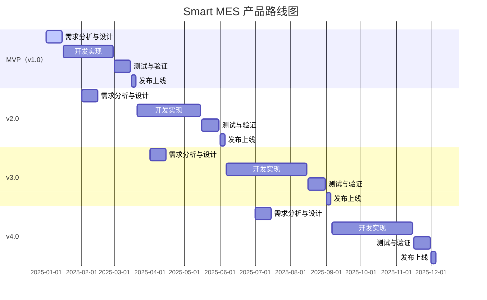

# 产品路线图（Roadmap）

## 1. 路线图概述

Smart MES（智能制造执行系统）的产品路线图规划了从MVP到未来版本的功能演进路径，旨在帮助制造企业实现生产全流程的数字化、智能化管理。路线图遵循"核心功能优先、快速迭代、持续优化"的原则，确保产品能够快速交付价值，并根据市场反馈和技术发展不断演进。

## 2. 版本规划策略

1. **MVP（最小可行产品）**：聚焦核心功能，快速验证产品价值，确保基础生产管理流程能够正常运行
2. **v2.0**：完善生产管理功能，增强质量管理和设备管理能力
3. **v3.0**：引入高级功能，提升系统智能化水平，支持移动化操作
4. **v4.0**：深度集成IoT平台，实现设备智能管理和预测性维护

## 3. 详细版本规划

### 3.1 MVP版本（v1.0）

**发布时间**：2025年03月

**核心目标**：实现生产计划、执行和监控的基本功能，验证产品核心价值

**关键功能**：

| 功能模块 | 具体功能 | 优先级 |
|----------|----------|--------|
| 基础模块 | 用户与权限管理 | P0 |
| | 系统配置 | P1 |
| 生产计划模块 | 订单管理 | P0 |
| | 工单排程 | P0 |
| | 计划甘特图 | P1 |
| 生产执行模块 | 生产报工 | P0 |
| | 生产进度看板 | P0 |
| | 异常上报 | P1 |
| 质量管理模块 | 质检录入 | P1 |
| 设备管理模块 | 设备状态监控 | P1 |
| 数据看板模块 | 总览看板 | P0 |

**核心价值**：
- 实现从订单到生产的基本流程管理
- 提供直观的生产进度监控
- 支持生产数据的采集和统计

### 3.2 v2.0版本

**发布时间**：2025年06月

**核心目标**：完善质量管理和设备管理功能，增强系统的完整性和易用性

**关键功能**：

| 功能模块 | 具体功能 | 优先级 |
|----------|----------|--------|
| 生产执行模块 | 异常上报优化 | P1 |
| 质量管理模块 | 质量追溯 | P0 |
| | 不良品分析图表 | P0 |
| 设备管理模块 | 维护计划管理 | P0 |
| | OEE分析 | P0 |
| 数据看板模块 | 趋势分析图表 | P1 |
| | 部门/生产线对比 | P1 |
| 次要功能 | 报表生成 | P1 |
| | 数据导入导出 | P1 |

**核心价值**：
- 实现全链路质量追溯，降低质量风险
- 提供设备维护管理，提高设备利用率
- 增强数据分析能力，支持决策制定

### 3.3 v3.0版本

**发布时间**：2025年09月

**核心目标**：引入高级功能，提升系统智能化水平，支持移动化操作

**关键功能**：

| 功能模块 | 具体功能 | 优先级 |
|----------|----------|--------|
| 移动应用 | 微信小程序开发 | P0 |
| AI智能算法 | 设备故障预测 | P1 |
| | 智能生产排程 | P1 |
| 数据看板模块 | 高级数据分析 | P0 |
| | 自定义报表 | P1 |
| 次要功能 | 系统日志 | P1 |
| | 消息通知 | P1 |

**核心价值**：
- 支持移动端操作，提高工作效率
- 引入AI算法，提升系统智能化水平
- 提供更丰富的数据分析功能，支持自定义需求

### 3.4 v4.0版本

**发布时间**：2025年12月

**核心目标**：深度集成IoT平台，实现设备智能管理和预测性维护

**关键功能**：

| 功能模块 | 具体功能 | 优先级 |
|----------|----------|--------|
| IoT集成 | MQTT协议支持 | P0 |
| | 深度对接IoT平台 | P0 |
| AI智能算法 | 智能质量预测 | P1 |
| 次要功能 | 电子签名 | P1 |

**核心价值**：
- 实现与IoT平台的无缝对接，支持更多设备类型
- 提供更高级的AI预测功能，降低生产风险
- 支持电子签名，满足合规要求

## 4. 功能优先级矩阵

| 功能模块 | 功能项 | P0 | P1 | P2 |
|----------|--------|----|----|----|
| 基础模块 | 用户与权限管理 | ✓ | | |
| | 系统配置 | | ✓ | |
| | 系统日志 | | | ✓ |
| | 消息通知 | | | ✓ |
| 生产计划模块 | 订单管理 | ✓ | | |
| | 工单排程 | ✓ | | |
| | 计划甘特图 | | ✓ | |
| 生产执行模块 | 生产报工 | ✓ | | |
| | 生产进度看板 | ✓ | | |
| | 异常上报 | | ✓ | |
| 质量管理模块 | 质检录入 | | ✓ | |
| | 质量追溯 | ✓ | | |
| | 不良品分析图表 | ✓ | | |
| | 智能质量预测 | | | ✓ |
| 设备管理模块 | 设备状态监控 | | ✓ | |
| | 维护计划管理 | ✓ | | |
| | OEE分析 | ✓ | | |
| | 设备故障预测 | | | ✓ |
| 数据看板模块 | 总览看板 | ✓ | | |
| | 趋势分析图表 | | ✓ | |
| | 部门/生产线对比 | | ✓ | |
| | 高级数据分析 | ✓ | | |
| | 自定义报表 | | ✓ | |
| 移动应用 | 微信小程序开发 | ✓ | | |
| | 原生APP开发 | | | ✓ |
| AI智能算法 | 智能生产排程 | | | ✓ |
| IoT集成 | MQTT协议支持 | ✓ | | |
| | 深度对接IoT平台 | ✓ | | |
| 次要功能 | 报表生成 | | ✓ | |
| | 数据导入导出 | | ✓ | |
| | 电子签名 | | | ✓ |

## 5. 详细时间线计划（里程碑）

## 6. 资源规划（初步建议）

### 6.1 人员需求

| 角色 | 数量 | 主要职责 |
|------|------|----------|
| 产品经理 | 1 | 需求分析、产品设计、版本规划 |
| UI/UX设计师 | 1 | 界面设计、交互设计 |
| 前端开发工程师 | 2 | 前端界面开发、交互实现 |
| 后端开发工程师 | 2 | 后端功能开发、系统集成 |
| 测试工程师 | 1 | 功能测试、性能测试、自动化测试 |
| 实施工程师 | 1 | 系统实施、客户培训、运维支持 |

### 6.2 技术资源

| 资源类型 | 具体内容 |
|----------|----------|
| 开发环境 | 开发服务器、测试服务器、CI/CD工具 |
| 数据库 | MySQL、Redis |
| 中间件 | RabbitMQ、WebSocket |
| 开发框架 | Spring Boot、Vue 3 |
| 第三方服务 | ECharts、甘特图组件 |

### 6.3 预算需求

| 项目 | 预算（万元） | 说明 |
|------|--------------|------|
| 人员成本 | 120 | 团队人员工资（6个月） |
| 硬件成本 | 10 | 开发服务器、测试服务器 |
| 软件成本 | 5 | 开发工具、第三方组件授权 |
| 实施成本 | 15 | 客户实施、培训、运维支持 |
| 其他成本 | 10 | 差旅费、会议费等 |
| **总计** | **160** | |

## 7. 风险管理

### 7.1 技术风险

| 风险项 | 风险描述 | 应对措施 |
|--------|----------|----------|
| ERP系统集成 | 不同ERP系统的接口差异较大，集成难度高 | 采用标准化接口设计，支持多种ERP系统的适配器开发 |
| IoT设备兼容性 | 设备类型多样，通信协议不一致 | 支持多种通信协议，提供设备接入SDK |
| 大数据处理 | 生产数据量大，查询性能可能受到影响 | 采用缓存技术（Redis），优化数据库查询，考虑分库分表 |

### 7.2 项目风险

| 风险项 | 风险描述 | 应对措施 |
|--------|----------|----------|
| 需求变更频繁 | 客户需求可能频繁变更，影响项目进度 | 采用敏捷开发方法，定期与客户沟通，控制需求变更范围 |
| 人员变动 | 核心团队成员可能离职，影响项目进展 | 建立完善的知识管理体系，文档化开发过程，培养后备人员 |
| 测试不充分 | 功能测试不充分，上线后可能出现大量问题 | 采用自动化测试，增加测试用例覆盖率，进行充分的用户测试 |

### 7.3 市场风险

| 风险项 | 风险描述 | 应对措施 |
|--------|----------|----------|
| 市场竞争激烈 | 市场上已有成熟的MES产品，竞争压力大 | 突出产品差异化优势，聚焦特定行业，提供优质的客户服务 |
| 客户接受度低 | 客户对新产品的接受度可能较低 | 提供免费试用，加强产品宣传和培训，建立成功案例 |

## 8. 成功指标

### 8.1 产品成功指标

| 指标 | 目标值 | 测量方式 |
|------|--------|----------|
| 客户数量 | MVP版本后3个月内5家 | 客户签约数量 |
| 系统使用率 | 日活跃用户率 > 80% | 系统登录日志统计 |
| 客户满意度 | > 85% | 客户满意度调查 |
| 功能完备率 | > 95% | 已实现功能/计划功能 × 100% |
| 系统稳定性 | 可用性 > 99.5% | 系统运行日志统计 |

### 8.2 业务成功指标

| 指标 | 目标值 | 测量方式 |
|------|--------|----------|
| 生产效率提升 | > 10% | 客户生产数据对比 |
| 质量追溯时间缩短 | > 50% | 客户反馈 |
| 设备OEE提升 | > 5% | 设备数据统计 |
| 异常处理时间缩短 | > 30% | 异常处理日志统计 |

## 9. 版本迭代机制

1. **迭代周期**：每2周进行一次迭代，包括需求分析、开发、测试和发布
2. **需求管理**：建立需求池，定期评审需求优先级，确定下一个迭代的功能范围
3. **开发流程**：采用敏捷开发方法，每日站会，迭代评审，持续集成和持续部署
4. **质量保障**：建立完善的测试体系，包括单元测试、集成测试、系统测试和用户测试
5. **用户反馈**：定期收集用户反馈，及时调整产品方向和功能优先级

## 10. 路线图更新机制

1. **定期评审**：每季度对路线图进行一次评审，根据市场反馈和技术发展调整规划
2. **灵活性调整**：允许根据业务需求和技术变化对路线图进行必要的调整
3. **透明沟通**：向团队和客户公开路线图，确保各方对产品发展方向有清晰的认识
4. **数据驱动**：基于用户反馈、市场数据和产品指标调整路线图优先级

---

**文档版本**：V1.0
**更新日期**：2025-11-25
**作者**：产品团队